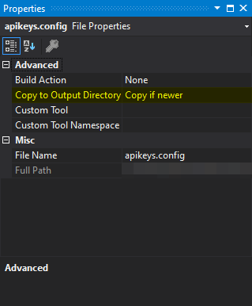

# Weather API Fetcher

A very simple weather API consumption C# console application.  

## Adding your API key
This app requires a valid Dark Sky API key, which is free to use. Sign up at [https://darksky.net/dev](https://darksky.net/dev) and get your API key. Edit the file called `apikeys.config` in the project root folder (next to `App.config`). Edit the file, replacing `YOURAPIKEY` with your key:
```
<appSettings>
  <add key="DarkSkyAPIKey" value="YOURAPIKEY"/>
</appSettings>
```
Then in Visual Studio, open the Properties of `apikeys.config` and change the value of "Copy to Output Directory" to "Copy if newer".  



## Restore packages
You'll need to restore the NuGet packages to build the application. Right-click the project in Visual Studio and click Manage NuGet Packages. You'll see the packages listed with an option to restore the packages. Click Restore to do so.

### Credits
Powered by the following:  
* [Dark Sky API](https://darksky.net/poweredby/)
* [Zippopotam.us API](http://www.zippopotam.us/)
* [IP Vigilante API](https://www.ipvigilante.com/)
* [ipify API](https://www.ipify.org/)
* [RestSharp](https://github.com/restsharp/RestSharp)
* [Newtonsoft Json.NET](https://www.newtonsoft.com/json)
